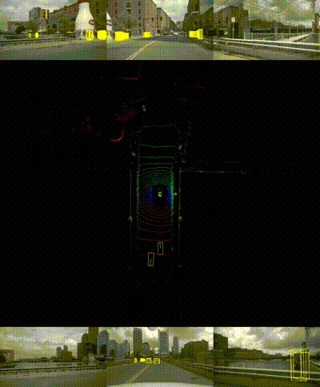

# BEVDet_Dual



## Introduction
We build a dual-branch bird=eye-view perception model and mainly refer to the following two papers:
1.  https://arxiv.org/abs/2112.11790
2.  https://arxiv.org/abs/2203.17054


## Get Started

#### Installation and Data Preparation

step 1. Please prepare environment:
```
pip install torch=1.10.0+cu113 -f https://mirrors.tuna.tsinghua.edu.cn/anaconda/cloud/pytorch/linux-64/
pip install torchvision=0.11.1+cu113 -f https://mirrors.tuna.tsinghua.edu.cn/anaconda/cloud/pytorch/linux-64/
pip install torch-scatter -f https://pytorch-geometric.com/whl/torch-1.11.0+cu113.html
pip install torch-sparse -f https://pytorch-geometric.com/whl/torch-1.11.0+cu113.html
pip install torch-cluster -f https://pytorch-geometric.com/whl/torch-1.11.0+cu113.html
pip install torch-spline-conv -f https://pytorch-geometric.com/whl/torch-1.11.0+cu113.html
pip install -U -i https://pypi.tuna.tsinghua.edu.cn/simple torch_geometric==2.5.0
pip install mmcv-full=1.5.3 -f https://download.openmmlab.com/mmcv/dist/cu113/torch1.10.0/index.html
pip install mmdet=2.25.1 mmsegmentation=1.0.0rc4 -i https://pypi.tuna.tsinghua.edu.cn/simple 
pip install numba==0.53.0 
```

step 2. Prepare bevdet repo by.
```shell script
git clone https://github.com/Wj-costumer/BEVDet_Dual.git
cd BEVDet
pip install -v -e .
```

step 3. Prepare nuScenes dataset as introduced in [nuscenes_det.md](docs/en/datasets/nuscenes_det.md) and create the pkl for BEVDet by running:
```shell
python tools/create_data_bevdet.py
```
step 4. For Occupancy Prediction task, download (only) the 'gts' from [CVPR2023-3D-Occupancy-Prediction](https://github.com/CVPR2023-3D-Occupancy-Prediction/CVPR2023-3D-Occupancy-Prediction) and arrange the folder as:
```shell script
└── nuscenes
    ├── v1.0-trainval (existing)
    ├── sweeps  (existing)
    ├── samples (existing)
    └── gts (new)
```

step 4. Download models(v1.0)
To test the model, please first download the trained model from the url(https://pan.baidu.com/s/1d7vXrqrM5304fumXX0sLBg?pwd=66is). And keep the models in the path workspace/ckpts/

#### Train model
```shell
# single gpu
python tools/train.py configs/bevdet_dual_occ/bevdet-occ-r50-4d-stereo.py
# multiple gpu
./tools/dist_train.sh configs/bevdet_dual_occ/bevdet-occ-r50-4d-stereo.py num_gpu
```

#### Test model
```shell
# single gpu perception
python tools/test.py configs/bevdet_dual_occ/bevdet-occ-r50-4d-stereo.py $checkpoint --eval mAP
# multiple gpu perception
./tools/dist_test.sh configs/bevdet_dual_occ/bevdet-occ-r50-4d-stereo.py $checkpoint num_gpu --eval mAP
# Entire Pipeline Test(Remained to be optimized) 
python tools/inference.py configs/bevdet_dual_occ/bevdet-occ-r50-4d-stereo.py ckpts/bev_occ.pth
```

## Next Steps
- Optimize the model structure
- Finish the tensorrt accelerating version
- Add fps test code
- Optimize the visualization code